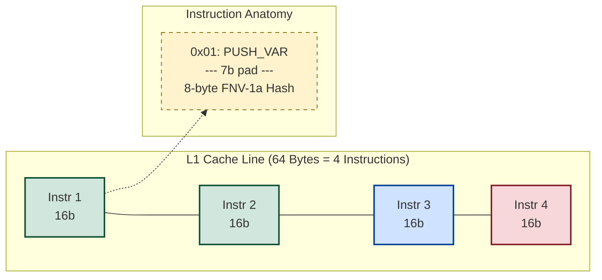
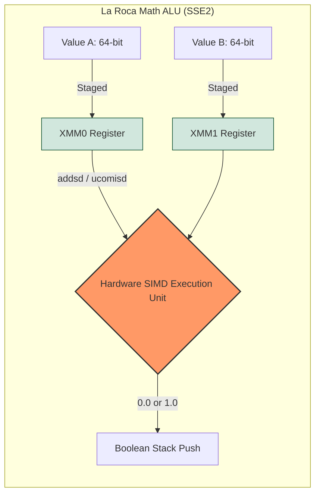
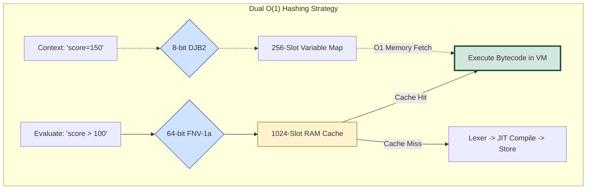
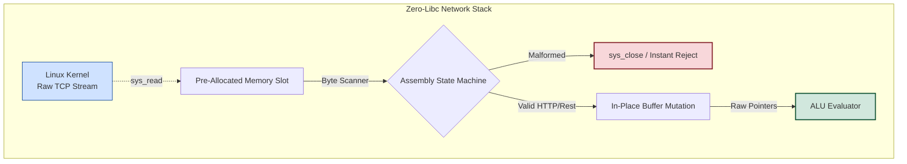
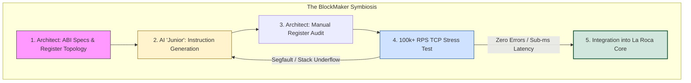

# Architecture of La Roca Rules Engine: From the Metal Up

La Roca Rules Engine is an exercise in uncompromising efficiency. In an era dominated by bloated runtimes, Abstract Syntax Trees (ASTs), and unpredictable Garbage Collectors, this document explores the low-level mechanics—from raw TCP `epoll` routing to SSE2 hardware acceleration—that allow a sub-20KB x86_64 Assembly engine to evaluate complex business logic at over **112,000 Requests Per Second (RPS)**.

---

## 1. The Geometry of Execution: Hybrid JIT & Stack Machine

In modern interpreters, parsing a mathematical or logical rule usually involves spraying the heap with dynamically allocated AST nodes. In **La Roca**, we discarded the heap entirely. Instead, we embraced **Deterministic Bytecode Geometry** and a Hybrid execution model to bridge the gap between flexibility and raw CPU throughput.

### 1.1 The 16-Byte Aligned Bytecode

Dynamic memory allocation is the enemy of predictable latency. Instead of instantiating objects, La Roca compiles linear rules into a strictly typed, 16-byte aligned bytecode format.

* **Zero Allocation Overhead:** No `malloc`, no `free`, and absolutely no hidden node metadata.
* **The Structural Contract:** `[OpCode (1 byte)] [Alignment Padding (7 bytes)] [Data/Hash (8 bytes)]`
* **L1 Cache Symbiosis:** The 7 bytes of padding aren't wasted space; they are structural armor. By enforcing a strict 16-byte width, instructions map perfectly into standard CPU Cache Lines (64 bytes). This allows the hardware prefetcher to ingest exactly 4 instructions per fetch cycle, guaranteeing that an opcode and its payload never straddle a cache memory boundary.



### 1.2 The Hybrid Engine (Tactical Bailout)

Translating human-readable Infix notation (e.g., `A OR (B AND C)`) into Postfix for a Stack Machine typically requires implementing complex algorithms like Dijkstra's Shunting-Yard. Doing this natively in Assembly introduces algorithmic bloat and branch mispredictions that contradict our zero-allocation philosophy.

To bypass this overhead, La Roca employs a **Hybrid JIT/Interpreter architecture**. The engine dynamically routes execution based on structural complexity, ensuring we never sacrifice throughput for feature depth.

* **The JIT Fast-Path (Linear Logic & Math):** Flat comparative rules and intensive mathematical operations (`price * 2 > 100`) are compiled directly into our 16-byte bytecode during their first evaluation. Subsequent requests bypass the parser entirely, executing on the VM at raw hardware speed.
* **The Tactical Bailout (Hierarchical Logic):** When the Lexer encounters deep structural complexity—such as nested parentheses or `AND`/`OR` gates requiring strict short-circuit evaluation—it triggers an immediate JIT bailout (`is_compiling = 0`). The engine seamlessly falls back to the native Assembly Interpreter.
* **Hardware-Backed Recursion:** Instead of building a traditional AST in the heap to resolve parentheses, the Interpreter leverages the physical CPU call stack (`push` / `pop` on `RSP`) to evaluate the logic tree recursively. This guarantees that even complex hierarchies strictly adhere to the engine's zero-allocation mandate.

```mermaid
graph TD
    Rule((Incoming Payload)) --> Lexer{O(1) Lexer/Parser}
    
    Lexer -->|Linear / Math| JIT[Emit 16-byte Bytecode]
    Lexer -->|Parentheses / OR| Bailout[Tactical Bailout: Abort JIT]
    
    JIT --> Cache[O(1) Cache Hit]
    Cache --> VM[Hardware-Accelerated VM]
    
    Bailout --> Interpreter[Native Assembly Interpreter]
    Interpreter --> Stack[CPU RSP Stack Framing]
    
    style VM fill:#d1e7dd,stroke:#0f5132,stroke-width:3px
    style Interpreter fill:#fff3cd,stroke:#856404,stroke-width:2px
    style Bailout fill:#f8d7da,stroke:#842029,stroke-width:2px
```

---

## 2. Hardware-Accelerated Logic & O(1) Memory

### 2.1 SSE2 Floating-Point ALU

In high-level languages, evaluating decimal arithmetic (e.g., `price * 1.5 > 100`) often involves software-based floating-point libraries (`soft-float`), dynamic type checking, and object allocation. This introduces massive latency penalties. **La Roca** bypasses software abstractions entirely, delegating mathematical logic directly to the CPU's silicon via the SSE2 instruction set.

* **SIMD Data Staging:** To avoid the latency of memory-to-memory arithmetic, all numerical values are parsed strictly as 64-bit IEEE 754 Doubles. During VM execution, these operands are staged directly into the processor's 128-bit `XMM0`-`XMM15` registers.
* **Native Instruction Routing:** Mathematical ALU operations (`+`, `-`, `*`, `/`) and boolean comparisons (`>`, `<`, `=`) do not call external libraries. The Bytecode VM routes operators to their corresponding native hardware instructions (e.g., `addsd` for addition, `mulsd` for multiplication, and `ucomisd` for unordered scalar comparisons).
* **Hardware Truthiness Coercion:** Logic gates (`AND`/`OR`) expect booleans, but our math ALU outputs raw floats. Instead of allocating intermediate Boolean objects, the VM handles "zero-state" coercion directly at the register level (`pxor xmm1, xmm1`). A computed `0.0` translates instantaneously to `False`, while any non-zero float evaluates to `True`, allowing pure mathematics to natively bridge into boolean logic.



### 2.2 O(1) Context Mapping (DJB2 & FNV-1a)

Traditional rule engines resolve variables by traversing dynamically resizing hash maps and performing costly byte-by-byte string comparisons (`strcmp`). **La Roca** eliminates string matching entirely during execution. It employs two specialized, statically allocated hashing strategies to achieve deterministic `O(1)` memory access:

1. **The Context Map (8-bit DJB2):** When the engine parses incoming context variables (e.g., `points=200`), it computes a fast, 8-bit DJB2 hash of the variable name on the fly. This hash acts as a direct index into a rigidly allocated 256-slot memory array. During VM execution, variables are resolved with a single `O(1)` memory fetch—completely bypassing string allocation, pointer chasing, or character comparison.
2. **The JIT Bytecode Cache (64-bit FNV-1a):** To avoid the overhead of re-parsing identical logic, the raw rule payload is fingerprinted using the high-entropy 64-bit FNV-1a algorithm. This hash acts as an exact memory offset pointing to a 1024-slot static RAM cache. If a match is found, the engine retrieves the pre-compiled 16-byte execution plan instantaneously, completely bypassing the Lexer and AST generation phases.



---

## 3. The Syscall Router: Life without Libc

Most modern runtimes are shackled to the heavy abstractions of the C Standard Library (`libc`) or bulky language virtual machines. **La Roca** severs this dependency entirely. By executing raw `syscall` instructions directly against the Linux kernel, we achieve a statically pure, "Zero-Libc" architecture. Eliminating user-space wrapper overhead is the foundational secret behind our 112,000+ RPS throughput.

### 3.1 Epoll Keep-Alive & Zero-Copy Mutation

The networking stack abandons high-level HTTP frameworks in favor of the raw Berkeley Sockets API, ruthlessly optimized for minimum context-switching and maximum hardware utilization.

* **The Epoll Event Loop:** Traditional thread-per-connection models destroy CPU caches via constant context switching. La Roca utilizes a single-threaded, asynchronous `epoll`-driven Keep-Alive loop. By multiplexing persistent TCP connections, we entirely bypass the kernel-level latency of the TCP 3-way handshake and socket teardown (`FIN_WAIT`/`CLOSE_WAIT`), allowing the core to dedicate 100% of its cycles to mathematical evaluation.
* **Zero-Copy In-Place Mutation:** Incoming network streams are never deserialized or copied into heap-allocated "String objects." As the raw TCP payload lands in the processor's cache, the engine's Assembly state machine mutates the buffer in-place—surgically replacing characters like closing quotes (`"`) with null-terminators (`\0`). The engine then passes these raw memory pointers directly to the String ALU, achieving true zero-copy validation.



---

## 4. Engineering with an "Alien" Junior (The AI Methodology)

Building a production-ready JIT Compiler and Virtual Machine in pure x86_64 Assembly in 2026 is often dismissed as a "lost art." **La Roca** resurrected this discipline through a symbiotic methodology: pairing a Senior Systems Architect with a high-reasoning AI agent. However, to prevent the AI from introducing dangerous runtime unpredictable behaviors, it was strictly treated as an "Alien Junior"—a high-speed instruction synthesizer operating under uncompromising architectural constraints.

### 4.1 Modular Assembly & System V ABI Strictness

To eliminate the "algorithmic drift" (hallucinations) common in LLM-generated code, we enforced a **Modular Assembly** strategy. The AI was never asked to "write a database" or "build an engine." Instead, it was tasked with implementing hyper-isolated, atomic sub-routines.

* **Deterministic Register Pinning:** The Architect dictated the exact register topology for every function. The AI was given rigid maps (`RDI` exclusively for rule string pointers, `XMM0` for float results, `R12` for cryptographic hashing) and was forced to strictly comply with the System V ABI 16-byte stack alignment rules.
* **Atomic Component Isolation:** By siloing the logic, we mathematically verified each component.
    * *The SSE2 ALU:* Confined to pure SIMD register manipulation.
    * *The Logic Lexer:* A recursive state machine built solely for parenthesis depth-traversal.
    * *The VM Dispatcher:* A relentless Postfix loop executing 16-byte aligned instruction blocks.

### 4.2 Test-Driven Assembly (TDA) & Volatile Protection

In the absence of a high-level compiler’s safety nets (like the Rust borrow checker or C++ smart pointers), we relied on a brutal **Test-Driven Assembly** workflow to catch memory violations before they reached the disk.

* **Tactical Stack Shielding:** Bugs like *Segmentation Faults*—often caused by volatile register destruction (`RDI`, `R13`) during external ALU calls or kernel syscalls—were exposed through high-concurrency TCP stress tests. These were manually patched by the Architect using surgically placed `push`/`pop` shields to protect caller-saved registers from being clobbered by the VM.
* **The "Final Byte" Rule:** While the "Alien Junior" generated the boilerplate and identified branchless logic patterns, the human Architect executed the final audit. No instruction was merged without a manual review of its pointer-arithmetic implications, ensuring that the System V ABI was respected at every memory offset.



---

---

## 5. Future Horizons: The BlockMaker Roadmap

La Roca is designed to be the bedrock of a new generation of hyper-efficient infrastructure. Our roadmap for 2026 focuses on expanding hardware-level capabilities while maintaining our strictly minimal footprint.

* **🔒 Multi-Core Scaling (Q2 2026):** Implementing a thread-per-core affinity model to scale the `epoll` event loop across all available CPU cores, targeting millions of RPS.
* **🌍 Aarch64 Porting:** Bringing La Roca’s sub-20KB efficiency to ARM64 architectures, targeting Apple Silicon and high-density AWS Graviton instances.
* **⚡ AVX-512 Parallel Evaluation:** Leveraging ultra-wide registers to perform SIMD-accelerated pattern matching and numerical comparisons across multiple rule branches simultaneously.
* **📡 io_uring Migration:** Transitioning from standard synchronous syscalls to Linux `io_uring` for true asynchronous, zero-copy I/O, further reducing context-switch penalties.
* **📊 Assembly-Native Metrics:** A built-in Prometheus-compatible exporter written in pure Assembly to provide real-time observability without a high-level runtime.

---

## 🛡️ Engineered by BlockMaker

**La Roca** is more than a rules engine; it is a statement against software bloat and a return to deterministic, instruction-level engineering.

* **Design & Architecture:** Fernando Ezequiel Mancuso
* **Organization:** [BlockmakerCompany](https://github.com/BlockmakerCompany)
* **Release:** March 2026 | Stable Build 1.0.0
* **Inquiries:** For industrial integration or low-level consulting, reach out via [GitHub Issues](https://github.com/BlockmakerCompany/la-roca-rules-engine/issues).

> *"If it requires a library, it doesn't belong in the core."* > — **The BlockMaker Manifesto**

---

## 🛡️ Lead Architect

**Fernando Ezequiel Mancuso** *Systems Architect & Low-Level Specialist* [LinkedIn Profile](https://www.linkedin.com/in/fernando-ezequiel-mancuso-54a2737/)

> "The distance between the metal and the code is where true efficiency lives."  
> — **BlockMaker Philosophy**